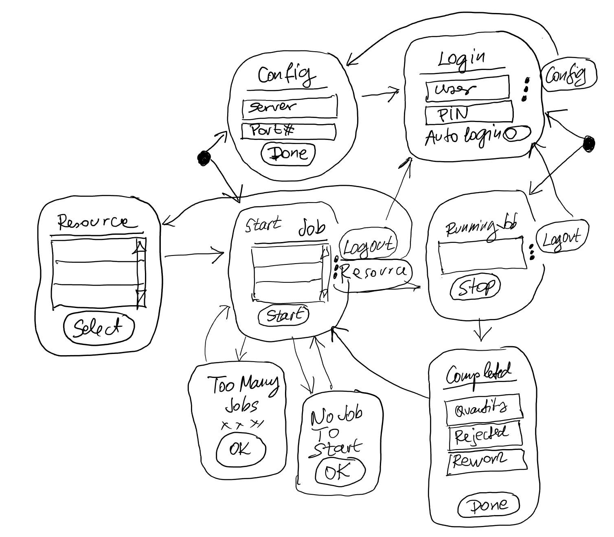

# T11 Job Watch - a Watch-Friendly Mobile Manufacturing Job Tracking Application for SAP B1

My initial enthusiasm towards JQM is even higher, far the best UI technology for mobile even sub-mobile watch-friendly business application development.

The best thing I really like with JQM is the single-page approach with navigations between sections/pages.

 

 ## How I initialized the project
- npm init
- npm install typescript tsify watchify --save-dev
- npx tsc --init
- Use **Tizen Studio** to create **basic template** app in **JobWatch** folder using the t11jobwatch folder as workspace 
- The project is implemented with [jQuery Mobile 2014 1.4.5](https://jquerymobile.com)
  - [jQuery Mobile + Phonegap Build - How to make a slick app for FREE, 2018](https://youtu.be/bNw7lqNO6tA) is a quick, practical and excellent intro JQM
  - I simply downloaded [JQM 1.4.5](http://jquerymobile.com/resources/download/jquery.mobile-1.4.5.zip) simply clicking on the button [Latest Stable](http://jquerymobile.com/resources/download/jquery.mobile-1.4.5.zip) on JQM home.
    - The zip package containeg jquery.mobile JS and CSS files. It had a demo folder with a number of examples and images, and most importantly the regular jquery JS package in **demos/js/jquery.js**
    - I simply copied the entire contents into the **JobWatch/jquery** folder. I see no reason to break this original structure. I fully respect the decision of the creators of this brilliant library.
    - JQM doesn't work JQuery 3, but works fine with the 2016 released 2.2.4 and 1.12.4.
- I included Andy Matthews [jQuery-Mobile-Icon-Pack](https://github.com/commadelimited/jQuery-Mobile-Icon-Pack), too, and I used the ellipsis-v icon as the "more" symbol. I even learnedhow to adjust the icon's centering.
- **npm install @types/jquery @types/jquerymobile**
  - No need to install JQuery itself, only the type definitions are needed
  - [TypeScript and libraries such as jQuery (with .d.ts files)](https://stackoverflow.com/questions/26540165/typescript-and-libraries-such-as-jquery-with-d-ts-files)
  - I simply added two references to app.ts with leading triple slashes to the JQ and IQM type definitions, and everything worked great:
    - ///&lt;reference path="../../node_modules/@types/jquery/index.d.ts"/>
    - ///&lt;reference path="../../node_modules/@types/jquerymobile/index.d.ts"/>

   ## Additional modules for React and TypeScript support
   - npm install @types/jquerymobile @types/jquery @types/react @types/react-dom react react-dom
   
